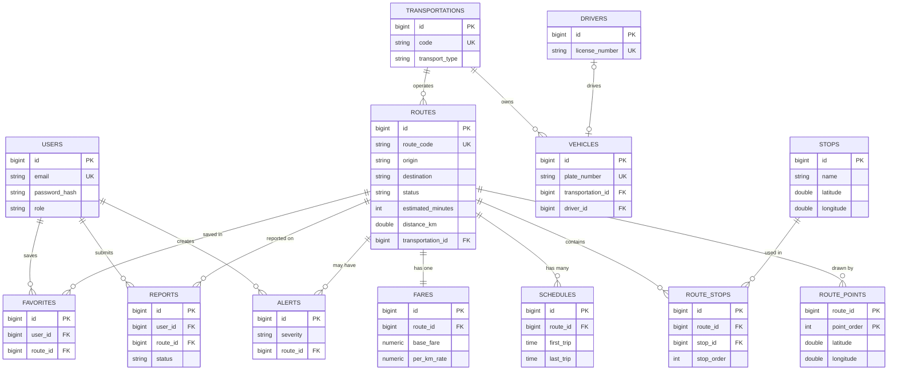

# Database Design — TransitHub (PostgreSQL)

> All sample rows are fictional demo data, not official transportation information.

## Entity Relationship Diagram

GitHub renders this diagram automatically.

## Design decisions (good answers for your defense)

| Decision | Why |
|---|---|
| **One `transportations` table for Bus, Jeepney and Van** (single-table inheritance) | The types share most columns. A `transport_type` column tells Java which subclass to build. Type-specific columns (`has_air_conditioning`, `is_modernized`, `seating_capacity`) are NULL for other types. |
| **`route_stops` is its own table** | A stop can be on many routes and a route has many stops (many-to-many). The table also stores `stop_order`, so it cannot be a plain join table. |
| **`route_points` separate from stops** | Stops are where people board. Points only shape the line on the map. |
| **Role is a column on `users`** | An admin has no extra data, only different permissions, so no `admins` table or subclass. |
| **Money is `NUMERIC(8,2)`** | Decimals like 0.1 are inexact in `double`. Java will use `BigDecimal`. |
| **Database `CHECK` constraints** | Latitude/longitude ranges, non-negative fares and valid statuses are enforced even if someone bypasses the API. The backend still validates too. |
| **Delete rules** | Deleting a route also deletes its stops-links, points, fare, schedules, favorites and reports (CASCADE). A transportation or stop that is still in use cannot be deleted (RESTRICT). Deleting a route keeps its alerts but clears the link (SET NULL). |
| **`is_demo_data` flag** | Lets the UI label sample data clearly. |
| **No `OTHER` transport type yet** | Every type needs a real Java subclass. Add one later if needed. |

## Normalization
- No repeating groups: stops, points, schedules and fares live in their own tables.
- Every non-key column depends only on its table's key (for example a stop's name is stored once in `stops`, not per route).
- Route origin/destination are plain text for simple searching.

## How the schema is applied
- `database/schema.sql` creates the tables (safe to re-run).
- `database/seed/sample-data.sql` inserts demo data (run once).
- Docker runs both automatically the first time the database starts empty.
- In Phase 3 Hibernate is set to `validate`: it only checks that the Java entities match these tables and never changes them.
