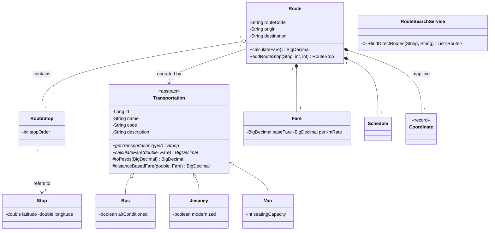

# OOP Design — TransitHub

This document explains where each of the four OOP principles appears in the Java code, and why
it fits a transportation system. All class names below are real classes in
`backend/src/main/java/com/transithub/`.

> Fares in the demo data and the fare formulas are sample rules for a school project,
> not official fares.

## 1. Class diagram (description)



Other classes: `Vehicle` (belongs to a `Transportation`, optional `Driver`), `Driver`, `User`
(with a `Role` enum), `Alert`, `FavoriteRoute`, `Report`.

## 2. Parent-child relationships

| Parent | Children | What the children inherit |
|---|---|---|
| `Transportation` (abstract) | `Bus`, `Jeepney`, `Van` | `id`, `name`, `code`, `description`, validated getters/setters, and the helper methods `toPesos`, `distanceBasedFare`, `checkFareInputs` |

Each child adds only what is specific to it (`airConditioned`, `modernized`, `seatingCapacity`).

**Where we deliberately did NOT use inheritance:** there is no `Admin extends User`. An admin has
no extra data or behavior, only different permissions, so a `Role` enum is the honest design.

## 3. Abstract classes

`Transportation` is abstract. A "plain transportation" does not exist in the real world, only a
bus, a jeepney, a van and so on, so you cannot write `new Transportation(...)`.
It declares two abstract methods that every child must implement:

```java
public abstract String getTransportationType();
public abstract BigDecimal calculateFare(double distanceKm, Fare fareRule);
```

## 4. Interfaces

`RouteSearchService` (in `service/`) is the contract for finding routes between two places:

```java
List<Route> findDirectRoutes(String origin, String destination);
```

The controller and other services depend on the interface, not on one implementation. The first
implementation (direct routes only) is written in Phase 7. A later one that finds routes with
transfers could be added without changing the code that uses the interface.

## 5. Encapsulation examples

- All entity fields are `private`; access is only through getters and setters.
- Setters validate: `Stop.setLatitude` rejects values outside -90 to 90, `Fare.setBaseFare`
  rejects negatives, `Route.setEstimatedMinutes` rejects 0 or less.
- Controlled changes: `Route.getRouteStops()` returns a **read-only** list. Outside code must call
  `route.addRouteStop(...)`, which keeps both sides of the relationship consistent.
- Values that must stay consistent change together: `Route.setEndpoints(origin, destination)`
  (they must differ) and `Schedule.setOperatingHours(first, last)` (first must be earlier).
- Constructors force required data, so an invalid object cannot be created.
- `Coordinate` is an immutable `record`: once created it cannot change.
- Proof: `RouteEncapsulationTest`.

## 6. Polymorphism examples

**Method overriding / dynamic method dispatch.** The same call gives a different result depending
on the real object:

```java
List<Transportation> services = List.of(bus, jeepney, van);
for (Transportation t : services) {
    t.getTransportationType();            // "Bus", "Jeepney", "Van", ...
    t.calculateFare(30, fareRule);        // each type uses its own pricing rule
}
```

| Type | Fare rule (demo) | 30 km with base 13.00 and 0.85 per km |
|---|---|---|
| Jeepney | base fare covers the first 4 km, then rate per extra km | 35.10 |
| Bus | base + rate x distance, +10% if air-conditioned | 38.50 (42.35 aircon) |
| Van | base + rate x distance, rounded up to a whole peso | 39.00 |

**Used in real code.** `Route.calculateFare()` never checks which type it has. It just calls
`transportation.calculateFare(distanceKm, fare)` and the right subclass answers.

**Interface polymorphism.** Code that uses `RouteSearchService` works with any implementation.

Proof: `TransportationPolymorphismTest`.

## 7. Why each principle is appropriate here

- **Abstraction:** the app should say "give me the fare" without caring about the vehicle type.
- **Inheritance:** all five types really share identity data and helpers; copying them five
  times would be wasteful and error-prone.
- **Polymorphism:** fares are genuinely different per type. Without it we would need a growing
  `if (type == BUS) ... else if (type == JEEPNEY) ...` chain in every place that needs a fare.
- **Encapsulation:** route and stop data drives the map. Invalid coordinates or a route without
  a destination would break the map, so the classes protect their own rules.

## 8. Scope: three transportation types

TransitHub models the three types that actually serve the Lipa - Batangas area: **bus, jeepney and van**.
Shuttle and train were considered and removed from the scope. The design makes adding a type easy
(the "open for extension" idea): create one more subclass of `Transportation`, add its value to the
`TransportType` enum, add a `case` in `TransportationService.create`, and allow its name in the
`transport_type` check of the database. No existing fare or route code has to change.

## 9. Database mapping note

All five types are stored in one table, `transportations`. The `transport_type` column
(the discriminator) tells Hibernate which subclass to create (`SINGLE_TABLE` inheritance).
